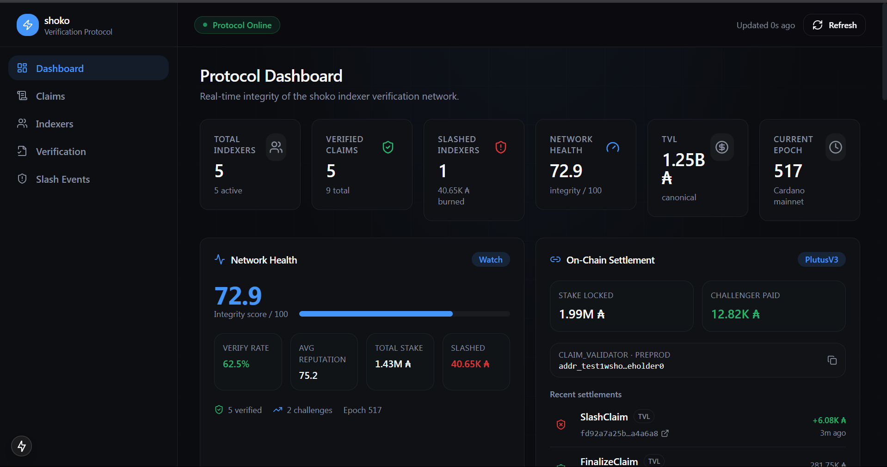

# SHOKO

### A decentralized, self-verifying data layer for Cardano.

---

## 1. Your Project

**SHOKO**

Team: **ADAstra**
Event: **IndiaCodex'26 — Cardano Hackathon (General Cardano Track)**

---

## 2. Your Project's Description

SHOKO is a decentralized, cryptoeconomically-enforced data verification protocol for Cardano. Instead of relying on a single company's servers to report what's happening on-chain (pool performance, DeFi activity, protocol health), SHOKO lets **anyone** submit that data — but only by staking real ADA behind it as a promise of accuracy.

Every claim is:
- **Staked** — the submitter locks up ADA as a financial guarantee
- **Recorded permanently** — minted as an on-chain NFT receipt, timestamped and tamper-proof
- **Independently verifiable** — checked against real Cardano chain state, made possible by Cardano's deterministic eUTXO model
- **Automatically enforced** — if the claim is wrong, the staked deposit is slashed by the validator, with no human arbitration required

The result is a data layer that has no single point of organizational failure — no company, no payroll, no small team whose departure can take Cardano's visibility infrastructure down with them.

---

## 3. What Problem You Are Trying to Solve

In June 2026, **TapTools** — the default analytics platform used by over 1 million Cardano users for prices, DeFi metrics, staking data, and portfolio tracking — shut down permanently. The cause wasn't bad or dishonest data; TapTools was reliable throughout its operation. The cause was **organizational collapse**: five senior executives (both co-founders, the COO, the CTO, and the CTO's replacement) left the company within a single year, alongside rising infrastructure costs during a prolonged market downturn.

This exposed a structural weakness across Cardano's entire "visibility layer": the tools people depend on to understand what's happening on-chain are almost all run by single, centralized companies. If the specific handful of people running any one of them leave, or the company runs out of funding, the data and dashboards an entire ecosystem depends on can vanish overnight — with no warning and no automatic replacement. Even current, well-funded alternatives (e.g., BendingAI) share this same structural risk, regardless of product quality.

**SHOKO's core problem statement:** Cardano doesn't have a data-accuracy problem — it has a trust-custody problem. The ecosystem needs a data verification layer that doesn't depend on any single company's payroll to keep functioning.

---

## 4. Tech Stack Used While Building the Project

**Smart Contract Layer**
- **Aiken** — validator logic for staking, verification, and automated slashing
- Deployed on **Cardano Preprod Testnet**

**Data Layer**
- **Blockfrost** — reads live Cardano chain data for independent claim verification
- **Native Cardano Assets** — claim NFT receipts, minted directly on-ledger

**Application Layer**
- **Mesh SDK** — transaction building and wallet integration
- **Next.js** + **Tailwind CSS** — live dashboard frontend
- **Cardano Connect with Wallet** (CIP-30/45) — wallet connection

**Development & Testing**
- **Yaci DevKit** — local Cardano devnet for rapid iteration
- **Lace Anatomy** / **Gastronomy** — transaction and validator debugging

---

## 5. Project Demo Photos, Videos

## 6. Live Project Link

**Live Demo:** [Link](https://shoko-adastra.vercel.app/)

---

## 7. Your PPT Link

**Presentation:** https://docs.google.com/presentation/d/1OGpj-yvlniN6fNMtnKRhVn37OhHPVfJZLuuc3xRzjvo/edit?usp=sharing

---

## 8. Your Team Members' Info

| Name | Team |
|---|---|
| K Satya Sai Nischal | ADAstra |
| D Riyaz | ADAstra |
| Rishith Kumar Guntuka | ADAstra |
| Isha Parveen | ADAstra |

**Team Name:** ADAstra
**Project:** SHOKO
**Track:** General Cardano — IndiaCodex'26
